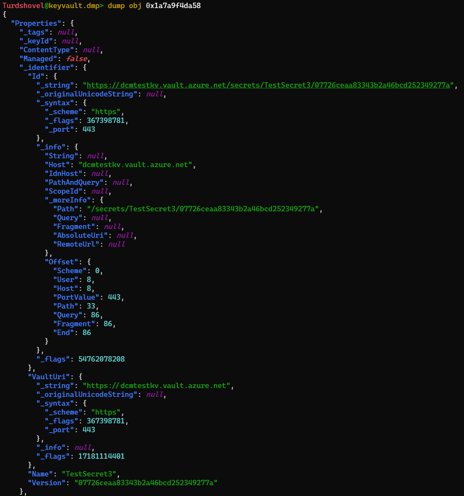

# Turdshovel


<p align='center'></p>

# Description

Turdshovel is an interactive CLI tool that allows users to dump objects from .NET memory dumps without having to fully understand the intricacies of WinDbg. It uses [Python.NET](https://github.com/pythonnet/pythonnet) to wrap around [ClrMD](https://github.com/microsoft/clrmd) and perform basic operations for dumping objects and sections of memory. The primary goal of Turdshovel is to focus on finding secrets in memory dumps quickly.

**It is absolutely not intended to be a full-fledged memory dump analysis tool.**

# Installation

Turdshovel is written in Python 3.8 and at the moment is expected to only work with Python 3.8. No testing has been performed with other Python versions. This is because Turdshovel has a dependency on [Python.NET](https://github.com/pythonnet/pythonnet), which requires specific installations of its files per Python version. This may change in the future with the release of Python.NET 3.0 and Turdshovel will support Python >3.8 as long as Python.NET supports it.

Additionally, Turdshovel is meant to be installed on **Windows** and has only been tested on **Windows**. No testing has been performed with Linux. However, Turdshovel uses the .NET Standard 2.0 versions of [ClrMD](https://github.com/microsoft/clrmd) which supports:

- .NET Core (2.0 - 6.0)
- .NET Framework (4.6.1 - 4.8)
- Mono (5.4, 6.4)

The inclusion of Mono may mean that Turdshovel works on Linux, especially since [ClrMD does support Linux](https://github.com/microsoft/clrmd/blob/master/doc/FAQ.md#what-platforms-are-supported). However, future plans for Turdshovel may include features that will be limited to Windows due to dependencies. These features will not be supported on other OSes, so a Windows environment is your best bet for usage.

Microsoft offers free Windows 10 development environment VMs [here](https://developer.microsoft.com/en-us/windows/downloads/virtual-machines/).

## Installing with Pipx

As a CLI tool, installation is highly recommended using [Pipx](https://github.com/pypa/pipx) to avoid any dependency confusions. **Honestly, you should use Pipx for most Python CLI tools!** Additionally, since Turdshovel only works with Python 3.8, this helps ensure that your virtual environment is set to use Python 3.8 at all times.

If your Pipx install was done with Python 3.8:  ```pipx install turdshovel```

If your Pipx install was done with different version: ```pipx install --python <path/to/python3.8> turdshovel```
<br>
<br>
# Usage

Turdshovel uses [Nubia](https://github.com/facebookincubator/python-nubia) as its framework for an interactive CLI.

| Command   | Arguments                                                                       | Description                           |
| :-------- | :------------------------------------------------------------------------------ | :------------------------------------ |
| load      |                                                                                 | Loads a dump for a session            |
| dump heap | **filter** - Filter objects by strings                                          | Lists objects on the heap             |
| dump obj  | **address** - Address of object to dump<br>**save** - Save ouput to disk        | Dumps object on heap by address       |
| dump mem  | **address** - Address of memory to read<br>**length** - Length of bytes to read | Dumps the memory in bytes at location |
| help      |                                                                                 | Show help                             |
| exit      |                                                                                 | Exit                                  |

---
##  Commands

<details>
<summary>load</summary>

The `load` command takes the path to the file dump as an argument.

<p align='center'></p>


</details>

<details>
<summary>dump heap</summary>

Similar to the dump heap command via [SOS](https://docs.microsoft.com/en-us/dotnet/core/diagnostics/sos-debugging-extension), this command will list the objects on the heap as well as their type. However, the output differs in that Turdshovel does not show objects which are listed as "Free" on the heap. You can optionally pass a list of strings as the filter.

<p align='center'></p>
</details>

<details>
<summary>dump obj</summary>

Similar to the dump obj command via [SOS](https://docs.microsoft.com/en-us/dotnet/core/diagnostics/sos-debugging-extension), this command will dump all of the non-static fields of the object on the heap in JSON representation. You can also pass `save=True` to save the resulting JSON to disk.
<br><br>

**IMPORTANT:** When dumping a complex object, you may noticed fields `<!>`. This indicates that the field would have caused a recursion error to occur so Turdshovel did not parse the field. This usually occurs with objects that reference themselves.

<p align='center'></p>
<p align='center'></p>

</details>

<details>
<summary>dump mem</summary>
Prints the bytes at the location specified for the amount of bytes specified. This is useful when objects point to locations in memory that are not objects, such as encrypted data, or just seeing what is around any given memory address. The example shows a simple string which you could find with the strings command but there are better use cases, specifically with pointers!

<p align='center'></p>


</details>
<br>

# Built With
- [Python-Nubia](https://github.com/facebookincubator/python-nubia) - CLI Framework
- [Python.NET](https://github.com/pythonnet/pythonnet) - Python/C# Interop
- [ClrMD](https://github.com/microsoft/clrmd) - .NET Diagnostics Library
- [Rich](https://github.com/willmcgugan/rich) - Amazing text, highlighting, and formatting
<br>

# Special Thanks
- [Steve Dower](https://twitter.com/zooba) - Helped fixed the recursion issue!